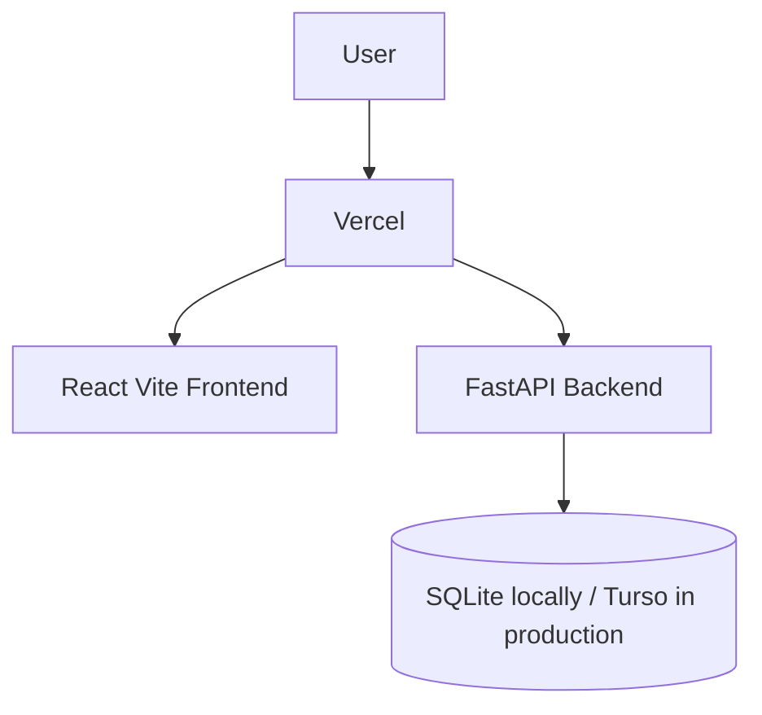

# Architecture

StockPilot uses a React frontend and FastAPI backend with a local SQLite database for development.

Phase 1 focuses on authentication, role-aware navigation, seeded users, departments, and a backend-driven dashboard. Business logic will continue moving into service modules as inventory and procurement features are added.
