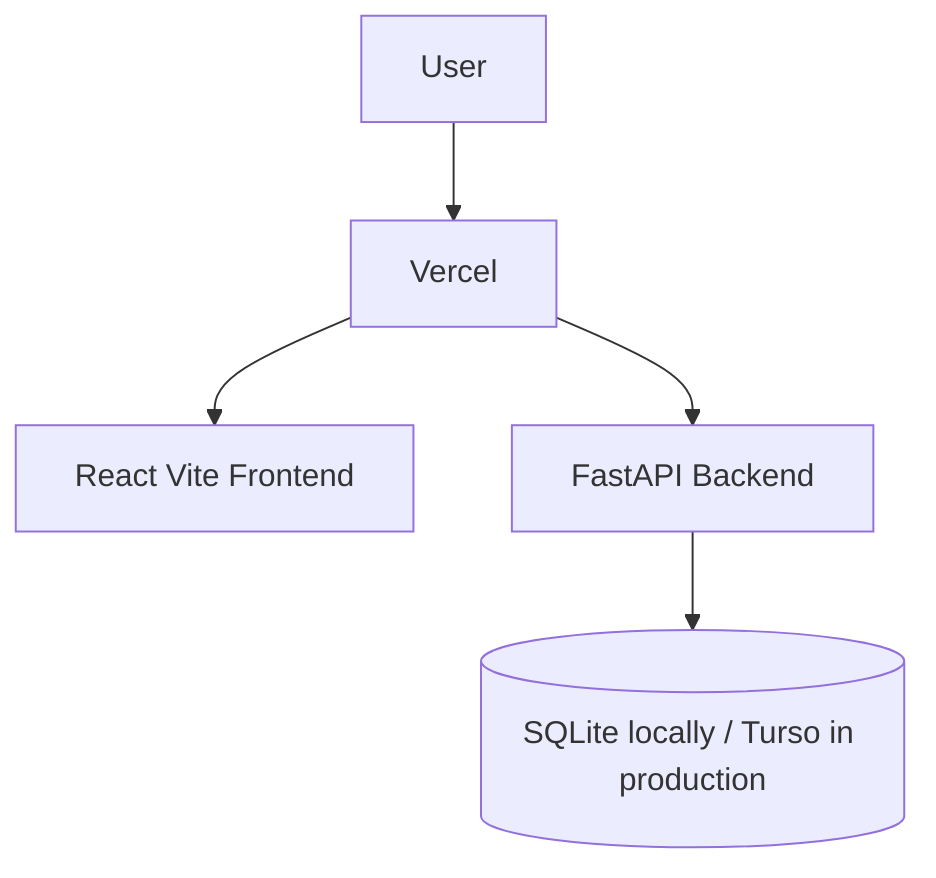

# Architecture

StockPilot uses a React frontend and FastAPI backend with a local SQLite database for development.

Phase 2 adds the catalog master data used by later inventory and procurement flows: categories, products, suppliers, and warehouses. Business logic will continue moving into service modules as stock balances, purchase requests, purchase orders, receiving, and transfers are added.
