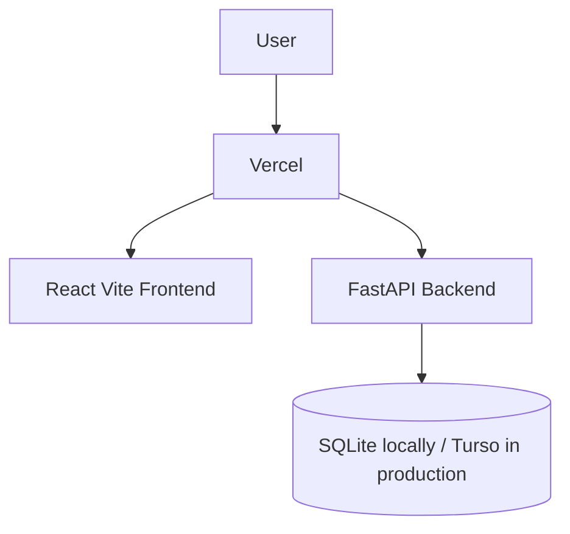

# Architecture

StockPilot uses a React frontend and FastAPI backend with a local SQLite database for development.

Phase 3 adds the inventory ledger used by later procurement and warehouse flows: per-warehouse balances, opening stock movements, backend stock status, and backend inventory valuation. Business logic will continue moving into service modules as purchase requests, purchase orders, receiving, issues, and transfers are added.
