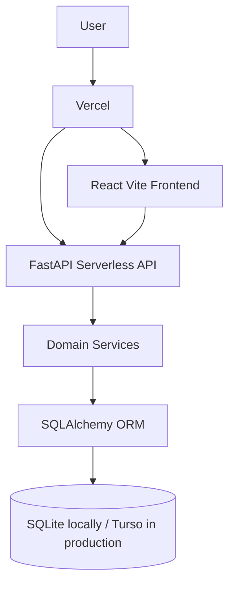

# Architecture

StockPilot uses a React/Vite frontend and FastAPI backend. Local development stores data in SQLite. Production should use Turso/libSQL or another SQLite-compatible serverless database.



## Layers

- `frontend/src/pages`: role-aware application screens.
- `frontend/src/services/api.ts`: authenticated Axios client.
- `backend/app/api`: FastAPI route modules and authorization boundaries.
- `backend/app/services`: business logic for catalog, inventory, procurement, warehouse workflows, analytics, audit logs, notifications, and reference generation.
- `backend/app/models`: SQLAlchemy persistence models.
- `backend/app/schemas`: Pydantic request and response schemas.
- `backend/app/seed`: fictional demonstration data and reset command.

## Request Flow

```text
React page -> TanStack Query -> Axios API client -> FastAPI route -> service function -> SQLAlchemy transaction -> database
```

Inventory-changing workflows use service functions so stock balances, stock movements, notifications, and audit logs are handled together.
