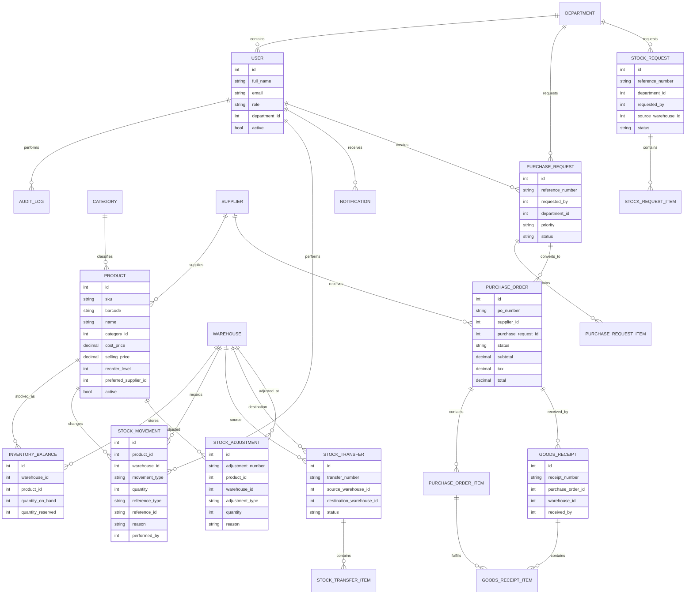

# Database

StockPilot persists business state through SQLAlchemy models. SQLite is the local default, and the same ORM layer can target Turso/libSQL in production.

## Integrity Rules

- SKU, supplier code, category name, and warehouse code are unique.
- Available stock is calculated as `quantity_on_hand - quantity_reserved`.
- Purchase order totals are calculated in the backend.
- Goods receipts cannot exceed remaining ordered quantities.
- Stock issues and transfers reject operations that would create negative stock.
- Completed transfer and receipt records are not silently modified.
- Stock quantity changes create `StockMovement` records.
- Important workflow actions create `AuditLog` records.
