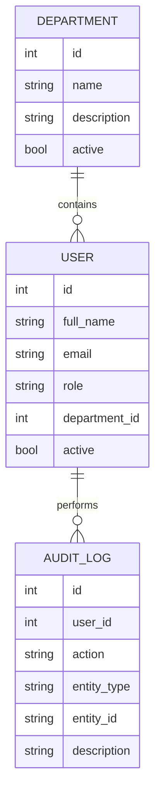

# Database

Phase 1 models:

Later phases will add products, categories, suppliers, warehouses, inventory balances, stock movements, purchase requests, purchase orders, goods receipts, stock requests, and transfers.
