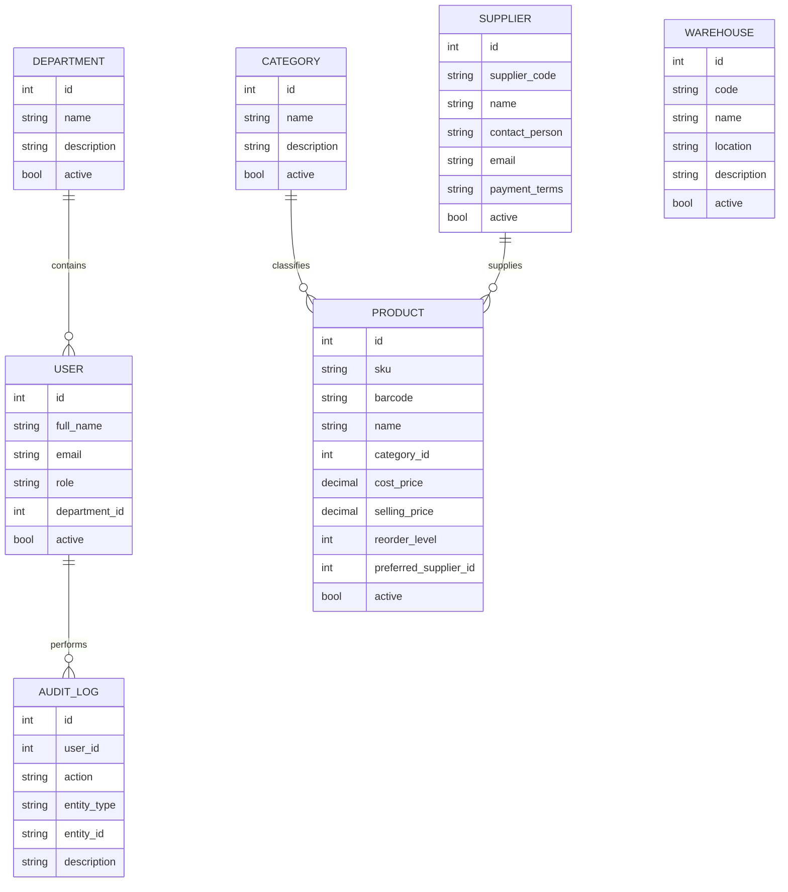

# Database

Phase 2 models:

```mermaid
erDiagram
    DEPARTMENT ||--o{ USER : contains
    USER ||--o{ AUDIT_LOG : performs
    CATEGORY ||--o{ PRODUCT : classifies
    SUPPLIER ||--o{ PRODUCT : supplies

    DEPARTMENT {
        int id
        string name
        string description
        bool active
    }

    USER {
        int id
        string full_name
        string email
        string role
        int department_id
        bool active
    }

    AUDIT_LOG {
        int id
        int user_id
        string action
        string entity_type
        string entity_id
        string description
    }

    CATEGORY {
        int id
        string name
        string description
        bool active
    }

    SUPPLIER {
        int id
        string supplier_code
        string name
        string contact_person
        string email
        string payment_terms
        bool active
    }

    WAREHOUSE {
        int id
        string code
        string name
        string location
        string description
        bool active
    }

    PRODUCT {
        int id
        string sku
        string barcode
        string name
        int category_id
        decimal cost_price
        decimal selling_price
        int reorder_level
        int preferred_supplier_id
        bool active
    }
```

Later phases will add inventory balances, stock movements, purchase requests, purchase orders, goods receipts, stock requests, and transfers.
