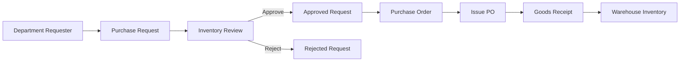

# Procurement Flow

StockPilot implements a straightforward procurement lifecycle without a complex workflow engine.

## Purchase Requests

Department requesters create purchase requests as drafts. Draft requests can be submitted for review. Inventory managers or administrators can approve or reject submitted requests.

Statuses:

- `DRAFT`
- `SUBMITTED`
- `APPROVED`
- `REJECTED`
- `CONVERTED_TO_PO`
- `CANCELLED`

## Purchase Orders

Procurement officers create supplier purchase orders. The backend calculates line totals, subtotal, tax, and total from purchase order items.

Statuses:

- `DRAFT`
- `ISSUED`
- `PARTIALLY_RECEIVED`
- `RECEIVED`
- `CANCELLED`

## Goods Receiving

Warehouse officers receive issued purchase orders. Partial receiving is supported. Receiving updates purchase order item quantities, recalculates PO status, increases warehouse stock, creates `GOODS_RECEIPT` movements, and records audit history.

## Notifications and Audit

Approvals, issued orders, receipts, stock issues, transfers, and adjustments create internal notifications and audit log entries so users can trace important operational events.
