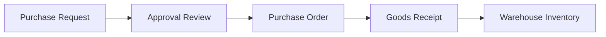

# Procurement Flow

The procurement lifecycle will be introduced in later phases.

The first implementation does not include the procurement tables yet. It prepares roles, authentication, departments, and the layout that later procurement screens will use.
